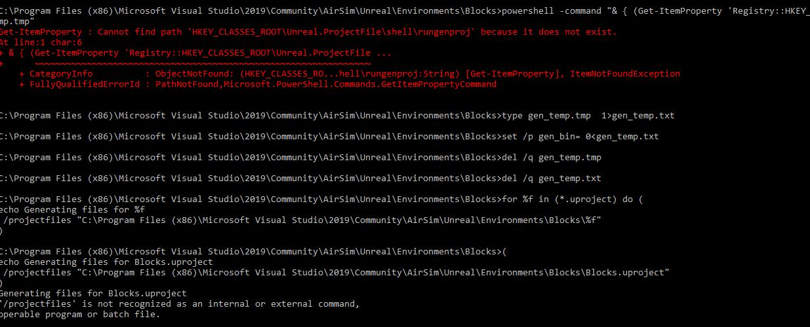
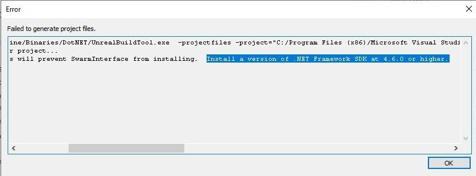

# Autodrive AirSim

Microsoft tarafından bilgisayarla görü ve reinforcement ile öğrenme gibi yapay zeka araştırmaları için geliştirilmiş özel bir simülatördür. Araba, drone gibi çeşitli kara ve hava alanlarında kullanılabilir. 

Airsim, Unreal Engine plugin'i olarak tasarlanmıştır ve hala geliştirme aşamasında olsa da Unity versiyonu da mevcuttur.

## Versiyon
v1.3.1 - Windows

## Kurulum

### Windows

AirSim bir Unreal plugin’i olarak tasarlanmıştır. Dolayısıyla kendi başına çalışamaz ve bir Unreal projesine (environment) ihtiyaç duyar. Airsim’i build edip test etmek 2 aşamadan oluşur:
* Build the plugin
* Deploy plugin in Unreal project and run the project.

Bu nedenle öncelikle bilgisayarımıza Unreal Engine (UE >= 4.22) kurmamız gerekir. Bunun için:
1.	Öncelikle Epic Games Launcher’ı indirin. Unreal Engine açık kaynak kodludur ama indirmek için Unreal Engine sitesinde hesap açmanız gerekmektedir. Hesap açtıktan sonra aşağıdaki linkten Epic Games launcher’ı indirin.
https://www.unrealengine.com/en-US/download
2.	İndirme işlemi tamamlanınca Epic Games launcher’ı açın ve üst taraftaki panelde bulunan “Library” tabını açın ve Engine Versions kısmındaki + butonuna tıklayarak Unreal 4.24 versionunu indirin.
3.	Daha sonrasında Airsim’i build etmek için Visual Studio 2019’u indirin. 
“Desktop Development with C++ “ ile “Windows 10 SDK 10.0.18362” seçeneklerinin seçili olduğundan emin olun.
Not: Eğer Airsim’deki PythonClient API’sini kullanacaksanız “Development with Python” paketini de seçin.

4.	İndirme tamamlandıktan sonra “Developer Command Prompt for VS 2019” ini açın ve Airsim reposunu clone’layın ve build edin.
```
git clone https://github.com/Microsoft/AirSim.git
cd Airsim
build.cmd
```

Build işleminden sonra, Unreal\Plugins klasöründe herhangi bir Unreal projesine bırakılabilen kullanıma hazır plugin bitleri oluşturulur.

5.	Son olarak airsim’i kullanabilmek için bir Unreal Projesine ihtiyacımız vardır. Bunun için örnek olarak Airsim ile birlikte gelen “Blocks Environment” i kullanacağız. Bu environment klasörü aşağıdaki dosya yolunda olabilir:
C:\Program Files (x86)\Microsoft Visual Studio\2019\Community\AirSim\Unreal\Environments\Blocks

```
$ cd \Unreal\Environments\Blocks
$ update_from_git.bat
```
Bu komutlardan sonra klasörün içinde bir Blocks.sln solution dosyası oluşması gerekir.
Eğer aşağıdaki gibi bir Key hatası alındıysa muhtemelen Unreal Engine build’i ile ilgili bir sorun vardır.
```
Error: Cannot find path 'HKEY_CLASSES_ROOT\Unreal.ProjectFile\shell\rungenproj' because it does not exist
```



Fix: Epic Launcher’ı tekrar çalıştırın ve karşınıza 
```
"Unreal Engine files are not associated, would you like to associate them?" 
```
gibi bir uyarı çıkarsa “Evet” i seçip tekrar “update_from_git.bat” komutunu çalıştırın ve bu sayede gerekli key’ler üretilmiş olur.

6.	Eğer sln dosyası üretilmediyse ve yine aynı klasörde (Unreal\Environments\Blocks ) bulunan  .bat dosyalarını kullanabilirsiniz:

```
$ clean.bat
$ GenerateProjectFiles.bat
```
Error: "generateProjectFiles.bat" komutunu çalıştırdıktan sonra buna benzer bir hata penceresi alırsanız:



```
Running C:/Program Files/Epic Games/UE_4.24/Engine/Binaries/DotNET/UnrealBuildTool.exe  -projectfiles -project="C:/Program Files (x86)/Microsoft Visual Studio/2019/Community/AirSim/Unreal/Environments/Blocks/Blocks.uproject" -game -rocket -progress -log="C:\Program Files (x86)\Microsoft Visual Studio\2019\Community\AirSim\Unreal\Environments\Blocks/Saved/Logs/UnrealVersionSelector-2020.04.28-22.53.31.log"
Discovering modules, targets and source code for project...
ERROR: Could not find NetFxSDK install dir; this will prevent SwarmInterface from installing.  
Install a version of .NET Framework SDK at 4.6.0 or higher.
```
Fix:
Bunu düzeltmek için Visual Studio Installerdan bilgisayarda yüklü olan visual studio versiyonununda “Modify” (Değiştir)’e tıklıyoruz. Daha sonra üstteki tablardan individual components (bağımsız bileşenler) kısmına tılayıp bizden update etmemizi istediği component’ı seçip uygun versiyon ile güncelliyoruz.
Daha sonrasında VS için olan develeoper command prompt’unda tekrardan aynı komutları çalıştırıyoruz.
```
$ clean.bat
$ GenerateProjectFiles.bat
```
Eğer proje dosyaları düzgünce üretiliyorsa "Generating Project Files..." yazılı bir pencere çıkması gerekmektedir.
Proje dosyalarını üretildikten sonra Unreal/Environments/Blocks dosya yolunda Blocks.sln dosyası oluşmuş olacaktır. Bu demektir ki kullanacağımız Unreal environmenti olan Blocks env. hazırlandı.

7.	Daha sonra üretilen “Blocks.sln” dosyasına çift tıklayıp Visual Studio ile açtığımızda yukardaki configuration kısmını “DebugGame_Editor” ve “Win64” olarak ayarlamanız gerekir.  
Daha  sonra Visual Studio’da “Play” butonuna basarak Unreal Projesini başlatın.
Build işlemi bitince Otomatik olarak UnrealEditor içerisinde seçtiğimiz Blocks  Environment açılacak. 
Compile işlemi bitince simulatörü çalıştırabilirsiniz.

8.	Unreal Editorde “Compiling Shaders” aşaması bitince "Play" butonuna tıklayın ve simülatörü çalıştırın.

### Documentation

(https://microsoft.github.io/AirSim/) on all aspects of AirSim.

### Paper

 [AirSim paper (FSR 2017 Conference)](https://arxiv.org/abs/1705.05065)


